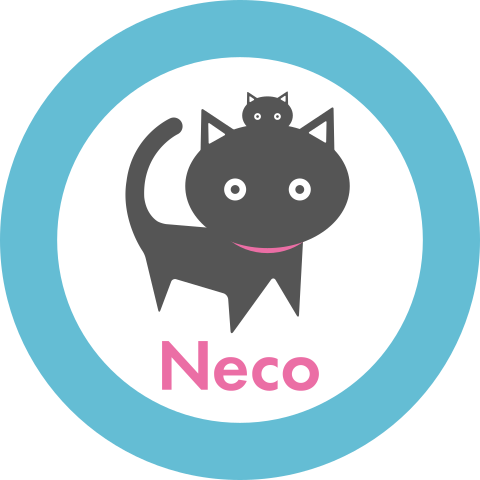

[][releases]
[](https://circleci.com/gh/cybozu-go/neco)
[][godoc]
[](https://goreportcard.com/report/github.com/cybozu-go/neco)



**Neco** is a project to build and maintain highly automated on-premise data centers using [Kubernetes][] at the center of its system.
The project is led by a [CNCF][] Silver member [Cybozu][] which is also known as [Kintone][] in the United States.

Neco is also the name of the architecture for systems built on the deliverables of the project.

Please read about [Project Neco: Building Cloud Native On-Premise Data Centers](https://blog.kintone.io/entry/neco).

Table of Contents:

- [Resources](#resources)
  - [Blogs](#blogs)
  - [Repositories](#repositories)
- [System overview](#system-overview)
  - [Boot servers](#boot-servers)
  - [Neco Continuous Delivery System (Neco CD)](#neco-continuous-delivery-system-neco-cd)
  - [Kubernetes](#kubernetes)
- [Network](#network)
  - [Design](#design)
  - [Node BGP and redundancy](#node-bgp-and-redundancy)
  - [DHCP and location of boot servers](#dhcp-and-location-of-boot-servers)
- [Tests](#tests)
  - [Virtual data center](#virtual-data-center)
  - [Large tests](#large-tests)
  - [Middle/Small tests](#middlesmall-tests)
- [Directories](#directories)

Resources
---------

### Blogs

- English: https://blog.kintone.io/archive/category/neco
- Japanese: https://blog.cybozu.io/archive/category/Neco

### Repositories

The project consists of a lot of repositories including:

- [cybozu-go/neco][neco]: The main repository.
- [cybozu/neco-containers][neco-containers]: Dockerfiles to build container images.
- [cybozu-go/sabakan][Sabakan]: Versatile network boot server.
- [cybozu-go/cke][CKE]: Cybozu Kubernetes Engine.
- [cybozu-go/coil][Coil]: [CNI][] plugin in favor of UNIX philosophy.
- [cybozu-go/topolvm][TopoLVM]: Capacity-aware [CSI][] plugin using LVM.
- [cybozu-go/placemat][placemat]: Virtual data center construction tool.

System overview
---------------


A Neco data center consists of a few (from 3 to 5) management servers called _boot sever_ and thousands of servers for a Kubernetes cluster; pretty big, huh?  In fact, Neco is designed to manage such large clusters.

### Boot servers

Boot servers are symmetrical with each other except for host names and IP addresses.

All persistent data are stored in an [etcd][] cluster.  Thanks to etcd, adding or removing a boot server can be done easily.

[Sabakan][] is a network boot server that supports DHCP and HTTP.  It can also manage an inventory of Node servers and assign IP addresses automatically.  Node servers should use [UEFI HTTP boot][HTTPBoot] to load [Flatcar][] from sabakan.

[CKE][], or Cybozu Kubernetes Engines, is a CNCF certified Kubernetes installer.  It queries Node server status to Sabakan and chooses Nodes to construct Kubernetes control plane and worker nodes.  TLS certificates required for Kubernetes are issued by [Vault][].

Boot servers are set up using a custom Ubuntu installer. [`installer`](./installer) directory contains the tools to build the custom installer.

### Neco Continuous Delivery System (Neco CD)

To bootstrap and maintain boot servers, a simple continuous delivery system called Neco CD is implemented in this repository.

Neco CD consists of these programs and artifacts:

- [`neco-updater`](./docs/neco-updater.md): a daemon to watch GitHub and notify `neco-worker` of new artifacts.
- [`neco-worker`](./docs/neco-worker.md): a daemon to install/update programs on a boot server.
- [`neco`](./docs/neco.md): CLI tool to bootstrap and configure boot servers.
- Neco debian package: archive of program binaries to be installed on boot servers.

Debian packages are built by CircleCI and released on [GitHub releases][releases].

Read [docs/cicd.md](docs/cicd.md) for details.

### Kubernetes

A Kubernetes cluster created with CKE is a vanilla installation; it almost has nothing useful.

We have selected a set of applications such as [Cilium][], [Teleport][] to make the vanilla Kubernetes fully featured.

Network
-------

### Design

Network of Neco is designed with these goals:

- Bare-metal performance, i.e., no overlays like [VXLAN][]
- Scalability, especially for [east-west traffic](https://searchnetworking.techtarget.com/definition/east-west-traffic)
- Vendor neutrality

The data center network for Neco should employ [leaf-spine topology](https://blog.westmonroepartners.com/a-beginners-guide-to-understanding-the-leaf-spine-network-topology/).  More specifically, each data center rack works as an autonomous system (AS) and exchanges routes with [BGP][].

Since BGP is a layer-3 routing protocol, use of layer-2 can be limited within a single rack.


### Node BGP and redundancy

Kubernetes nodes need to route packets for Pods.  Without overlay networking, this means that each node needs to advertise routing information.  In Neco, each node runs [BIRD][] to speak BGP and advertise routes for Pods.

For high availability, network links must be redundant.  Therefore, Neco requires that each rack has two Top-of-Rack (ToR) switches and each server has two ethernet links.  To reduce convergence time of BGP, [BFD][] is used together.

This means that ToR switches and node servers in a rack are all BGP speakers and need to connect each other as iBGP peers.  To make configurations simple and flexible, ToR switches are configured as [route reflectors](https://en.wikipedia.org/wiki/Route_reflector).

The two ToR switches are independent; each has its own managing subnet.  As a result, each server has two IP addresses for each ToR switch.  To tolerate single link or ToR switch failure, the server has another IP address called **the node address** with `/32` netmask and advertises it via BGP.


### DHCP and location of boot servers

[UEFI HTTP Boot][HTTPBoot] requires a DHCP server which requires layer-2 broadcast domain.  Without DHCP relay servers, a dedicated server must be run as a boot server for each rack because layer-2 domain does not span racks.

If ToR switches can provide DHCP relay, this requirement can be relaxed.

Tests
-----

### Virtual data center

To make continuous delivery reliable enough, thorough and comprehensive system tests need to be performed.
Since Neco is the system to bootstrap and maintain an on-premise data center, this means that the tests should do the same thing, that is, to bootstrap and maintain a data center!

To simulate an on-premise data center, we have created [placemat][], a tool to construct a virtual data center using containers, virtual machines and Linux network stacks.

The virtual data center implements the aforementioned leaf-spine networks with BGP routers.
To create the virtual data center, run the following commands on Ubuntu 22.04:

```console
$ sudo curl -o /etc/apt/keyrings/docker-key.asc -fsSL https://download.docker.com/linux/ubuntu/gpg 
$ echo "deb [arch=amd64 signed-by=/etc/apt/keyrings/docker-key.asc] https://download.docker.com/linux/ubuntu jammy stable" | sudo tee /etc/apt/sources.list.d/docker.list > /dev/null
$ sudo apt update
$ sudo apt install -y build-essential systemd-container lldpd qemu qemu-kvm socat picocom swtpm cloud-utils bird2 squid chrony dnsmasq jq freeipmi-tools unzip skopeo fakeroot docker-ce docker-ce-cli containerd.io
$ wget https://github.com/qemu/qemu/raw/master/pc-bios/bios.bin
$ wget https://github.com/qemu/qemu/raw/master/pc-bios/bios-256k.bin
$ sudo install -m 0644 -b bios.bin bios-256k.bin /usr/share/seabios/
$ wget https://github.com/cybozu-go/placemat/releases/download/v2.4.0/placemat2_2.4.0_amd64.deb
$ sudo dpkg -i ./placemat2_2.4.0_amd64.deb
$ git clone https://github.com/cybozu-go/neco
$ cd neco/dctest
$ make setup
$ make placemat
$ make test
```

- To login a boot server in the virtual data center, run `./dcssh boot-0`.
- To stop and delete the virtual data center, run `make stop`.

The setup commands above are examined on a GCP VM based on the Ubuntu 22.04 disk image.
Some more setup steps are needed for the GCP environment.

- [Enable nested virtualization by creating a custom image](https://cloud.google.com/compute/docs/instances/enable-nested-virtualization-vm-instances).
- Select a machine configuration with many vCPUs and much memory, e.g. n1-standard-32.
- Mount an additional local SSD scratch disk at `/var/scratch`.
- Stop and disable `systemd-resolved.service` and [prepare `resolv.conf`](https://cloud.google.com/compute/docs/internal-dns).
- [Install the latest Go](https://golang.org/dl/) and set `GOPATH`.

### Large tests

[dctest](dctest/) directory contains test suites to run large tests using the virtual data center.
Details are described in [docs/dctest.md](docs/dctest.md).

### Middle/Small tests

Other than large tests, this repository contains smaller tests that can be run as follows:

1. Setup the environment by `make setup`.  This is a one shot job.
2. Run etcd by `make start-etcd`
3. Run tests by `go test -v -count 1 -race ./...`
4. Stop etcd by `make stop-etcd`

Directories
-----------

Other than Go packages, this repository has the following directories:

- [`dctest/`](dctest/): Large tests using a virtual data center.
- [`debian/`](debian/): Ingredients for Debian package.
- [`docs/`](docs/): miscellaneous documentation.
- [`etc/`](etc/): Kubernetes manifests for networking and other configuration files.
- [`ignitions/`](ignitions/): [Ignition][] template files.


[releases]: https://github.com/cybozu-go/neco/releases
[godoc]: https://godoc.org/github.com/cybozu-go/neco
[BFD]: https://en.wikipedia.org/wiki/Bidirectional_Forwarding_Detection
[BGP]: https://en.wikipedia.org/wiki/Border_Gateway_Protocol
[BIRD]: https://bird.network.cz/
[Cilium]: https://cilium.io
[CKE]: https://github.com/cybozu-go/cke
[CNCF]: https://www.cncf.io
[CNI]: https://github.com/containernetworking/cni
[Coil]: https://github.com/cybozu-go/coil
[CSI]: https://github.com/container-storage-interface/spec
[Cybozu]: https://cybozu-global.com
[etcd]: https://etcd.io
[Flatcar]: https://www.flatcar.org/docs/latest/
[HTTPBoot]: https://github.com/tianocore/tianocore.github.io/wiki/HTTP-Boot
[Ignition]: https://www.flatcar.org/docs/latest/provisioning/ignition/
[Kintone]: https://www.kintone.com
[Kubernetes]: https://kubernetes.io
[neco]: https://github.com/cybozu-go/neco
[neco-containers]: https://github.com/cybozu/neco-containers
[placemat]: https://github.com/cybozu-go/placemat
[Sabakan]: https://github.com/cybozu-go/sabakan
[Teleport]: https://gravitational.com/teleport/
[TopoLVM]: https://github.com/cybozu-go/topolvm
[Vault]: https://www.vaultproject.io
[VXLAN]: https://en.wikipedia.org/wiki/Virtual_Extensible_LAN
