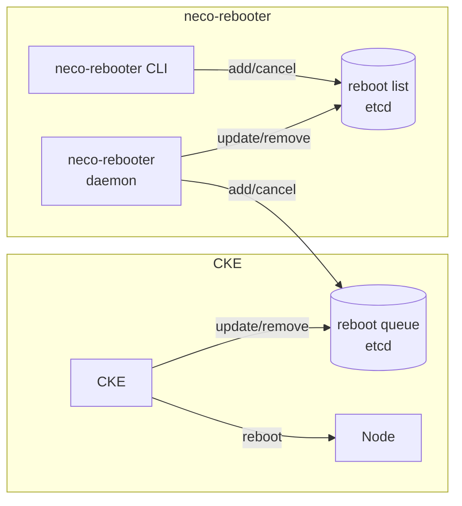

# neco-rebooter

neco-rebooter manages the reboot of nodes by using CKE's reboot function. neco-rebooter has the following features:

### 1. Reboot nodes at a specified time range.
neco-rebooter enqueues nodes to CKE's reboot queue at a specified time range.
Users can specify the time range that the nodes are allowed to be rebooted.
The configuration has a deny list and an allow list of the time and its format is cron format. So users can specify the time range flexibly.

### 2. Reboot nodes parallelly.
neco-rebooter enqueues nodes to CKE's reboot queue by each group, and no nodes with different groups are enqueued simultaneously.
Users can reboot nodes parallelly by following restrictions like a failure domain.
The group is defined by the value of the label specified in the configuration file.
If maxConcurrentReboots of CKE is set greater than 1, CKE reboots nodes in the reboot queue parallelly with the given parallelism, so if maxConcurrentReboots is enough high, neco-rebooter can reboot nodes parallelly.

## Terminology
- **neco-rebooter**: A set of tools to manage the reboot of nodes.
    - **neco-rebooter deamon**: A daemon process that manages the reboot of nodes.
    - **neco-rebooter CLI**: A set of CLI commands to manipulate the reboot list.
    - **reboot list**: A list of nodes that are scheduled to be rebooted. The list is saved in etcd.
    - **group**: A group of nodes that are allowed to reboot simulately. The group is determined by the label specified in the configuration.
    - **processing group**: A group of nodes that are currently being processed by neco-rebooter daemon.
    - **RebootTime**: A Struct that specifies the time range of the reboot and the nodes that belong it.
- [**CKE**](https://github.com/cybozu-go/cke): Cybozu Kubernetes Engine.
    - **Reboot queue**: A queue of nodes that are scheduled to be rebooted managed by CKE.
- [**Sabakan**](https://github.com/cybozu-go/sabakan): Versatile network boot server.

## How it works
1. Users add nodes to the reboot list by using neco-rebooter CLI. The list is saved in etcd.
2. neco-rebooter daemon reads the reboot list and finds the nodes in the processing group that can be rebooted at the current time.
3. neco-rebooter daemon adds nodes found in step 2 to CKE's reboot queue.
4. CKE reboots the nodes in the reboot queue.
5. If the reboot is completed, remove the node from the reboot list.
6. If there are nodes queued in the reboot queue that are out of the rebootable time range, neco-rebooter daemon cancels the reboot queue entry and updates the status in the reboot list to `Pending`
7. If the reboot queue is empty, neco-rebooter proceeds to the next group.
8. If the neco-rebooter is disabled, it cancels all the existing reboot queue entries and updates the status in the reboot list to `Pending`

The overall architecture is shown in the following diagram.



## Usage
```
neco-rebooter [OPTIONS]
```
|    Option     |             Default value             |       Description        |
| ------------- | ------------------------------------- | ------------------------ |
| `-cke-config` | `/etc/cke/config.yml`                 | Path of CKE config file. |
| `-config`     | `/user/share/neco/neco-rebooter.yaml` | Path of config file.     |


## Config file
|      Field      |              Type               | Default value |                                                    Description                                                     |     |
| --------------- | ------------------------------- | ------------- | ------------------------------------------------------------------------------------------------------------------ | --- |
| `rebootTimes`   | [RebootTime](#RebootTime) array | `nil`         | List of RebootTime. User can create RebootTime that belongs specified nodes.                                       |     |
| `timeZone`      | string                          | `""`          | Timezone of rebootTimes.                                                                                           |     |
| `groupLabelKey` | string                          | `""`          | key of the label to distinct group. Nodes that have same label value are regarded to be rebootable simultaneously. |     |
| `metricsPort`   | int                             | `10082`       | Port number for metrics server.                                                                                    |     |

### `RebootTime`
|      Field      |              Type               | Default value |                                                    Description                                                    |
| --------------- | ------------------------------- | ------------- | ----------------------------------------------------------------------------------------------------------------- |
| `name`          | string                          | `""`          | name of RebootTime.                                                                                               |
| `labelSelector` | [LabelSelector](#LabelSelector) | `nil`         | LabelSelector to select target nodes (similer with Kubernetes's LabelSelector, but only implements match labels.) |
| `times`         | [Time](#Time)                   | `nil`         | Time specified time range of the RebootTime. deny rule is prior to allow rule.                                    |

### `LabelSelector`
|     Field     |       Type        | Default value |       Description        |
| ------------- | ----------------- | ------------- | ------------------------ |
| `matchLabels` | map[string]string | `nil`         | key-value pairs of label |

### `Time`
|  Field  |     Type     | Default value |                                                                      Description                                                                       |
| ------- | ------------ | ------------- | ------------------------------------------------------------------------------------------------------------------------------------------------------ |
| `deny`  | string array | `""`          | Cron format string. In this time, reboot of the target nodes will not conducted. User can write multiple time. The time is evaluated with OR condition |
| `allow` | string array | `""`          | Cron format string. In this time, reboot of the target nodes will be conducted.User can write multiple time. The time is evaluated with OR condition   |

### example config
```yaml 
rebootTimes:
  - name: cs
    labelSelector:
      matchLabels:
        cke.cybozu.com/role: cs
    times:
      deny:
        - "* 0-23 1 * *"
      allow:
        - "* 0-6 * * 1-5"
        - "0-30 7 * * 1-5"
        - "30-59 19 * * 1-5"
        - "* 20-23 * * 1-5"
  - name: ss
    labelSelector:
      matchLabels:
        cke.cybozu.com/role: ss
    times:
      allow:
        - "* 0-23 * * 1-5"
timeZone: Asia/Tokyo
groupLabelKey: topology.kubernetes.io/zone
```
By this config, nodes that have `cke.cybozu.com/role: cs` label will be rebooted at 0:00-7:30 and 19:30-23:59 (JST) on Monday to Friday and not rebooted at 1st of month. And nodes that have `cke.cybozu.com/role: ss` label will be rebooted at whole day on Monday to Friday. In addition, nodes will be rebooted parallelly by each group of `topology.kubernetes.io/zone` label.

### Notes for the specifications
- The time range is evaluated with the timezone specified in the config file.
- If node matches multiple RebootTime, the node will be added to reboot list with the first matched RebootTime.

## neco-rebooter CLI
### Global options
|    Option     |                         Default value                          |            Description            |
| ------------- | -------------------------------------------------------------- | --------------------------------- |
| `-cke-config` | `/etc/cke/config.yml`                                          | Path of CKE config file.          |
| `-config`     | `/user/share/neco/neco-rebooter.yaml`                          | Path of neco-rebooter config file |
| `-kubeconfig` | `$KUBECONFIG` or `~/.kube/config` if `$KUBECONFIG` is not set. | Path of kubeconfig file           |


### `neco rebooter add FILE`

Append the nodes written in FILE to the reboot list. 
The nodes should be specified with their IP addresses. 
If FILE is -, the contents are read from stdin.

### `neco rebooter cancell-all`

Cancel all the reboot list entries.

### `neco rebooter cancel INDEX`

Cancel the specified reboot list entry.

### `neco rebooter enable/disable`

Enable/Disable neco-rebooter processing reboot list.

### `neco rebooter is-enabled`

Show whether neco-rebooter is processing reboot list.

### `neco rebooter leader`

Show the leader of neco-rebooter.

### `neco rebooter list`

Show the reboot list.

### `neco rebooter show-processing-group`

Show the processing group.

### `neco rebooter reboot-worker`

Reboot all woker nodes registerd in sabakan.
Machines outside the Kubernetes cluster are rebooted immediately after the command is executed.

User can pass the sabakan option to select the target nodes.


Available sabakan options are:

|          Option           |               Description               |
| ------------------------- | --------------------------------------- |
| `serial=<serial>,...`     | The serial number of the machine        |
| `labels=<key=value>,...`  | The labels of the machine.              |
| `rack=<rack>,...`         | The rack number where the machine is in |
| `role=<role>,...`         | The role of the machine                 |
| `ipv4=<ip address>,...`   | IPv4 address                            |
| `ipv6=<ip address>,...`   | IPv6 address                            |
| `bmc-type=<bmc-type>,...` | BMC type                                |
| `state=<state>,...`       | The state of the machine                |

Each query name can be prefixed with `without-`. This prefix negates the condition.

See [cybozu-go/sabakan](https://github.com/cybozu-go/sabakan/blob/main/docs/sabactl.md#sabactl-nodes-get-query_param) for more details.

## Operation example

### start reboot of all worker nodes
```console
$ neco rebooter reboot-worker --without-state retiring,retired
```

### stop reboot temporarily
```shconsoleell
$ neco rebooter disable
```

### resume stoped reboot
```console
$ neco rebooter enable
```

### cancel reboot
```console
$ neco rebooter cancel-all
```

### cancel reboot of specific node
```console
$ neco rebooter cancel <index>
```

### reboot specific nodes
```console
$ neco rebooter add FILE 
```
or
```console
$ echo <node name> | neco rebooter add -
```
